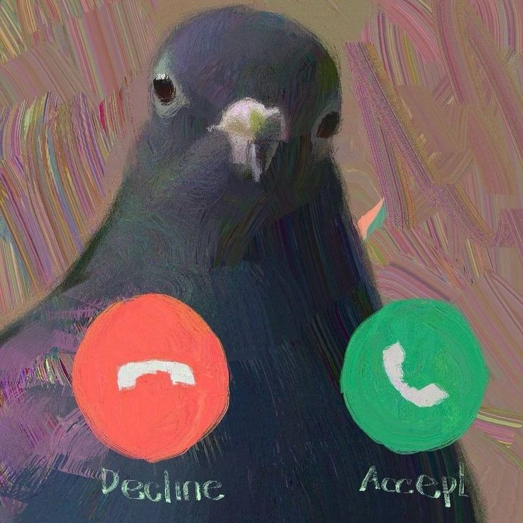

# Week 01

[← Back to Home](../index.md)

## Documentation 

*lata*

## Images & Media

*Use the format below to embed images from your assets folder:*

`*Pigeon Sir*`

*The text inside the square brackets is alt text (a description for accessibility), not a visible caption. To add a caption, place a line of italic text below the image.*

## AI Usage Statement

*Document any use of AI tools under an AI Usage Statement heading. Explain which tools you used and describe how you used them. Reference any AI-generated content (see [QuickCite](https://auckland.libguides.com/referencing-generative-ai-tools) for guidance).*
