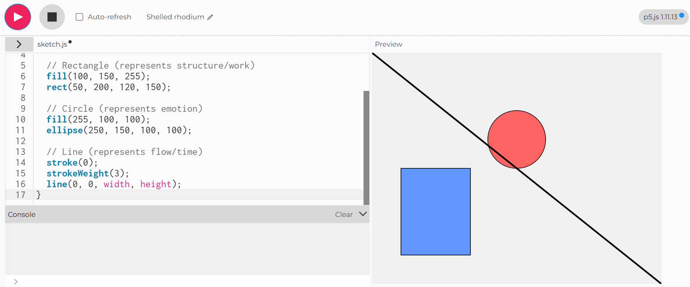
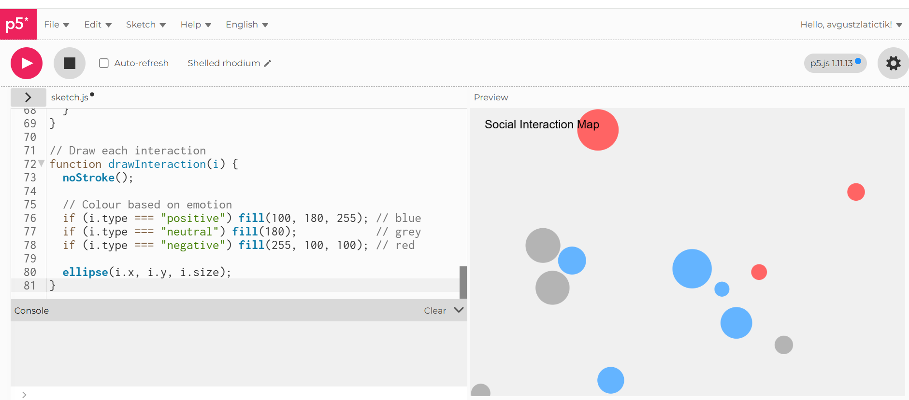
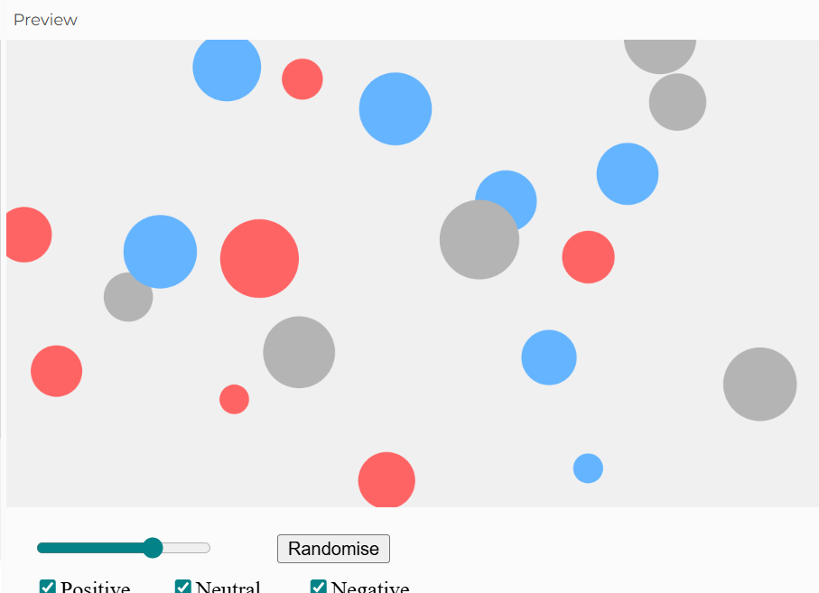
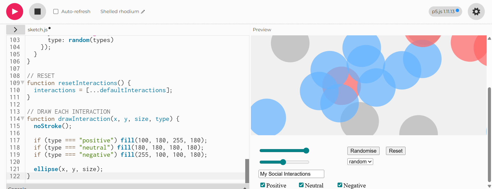
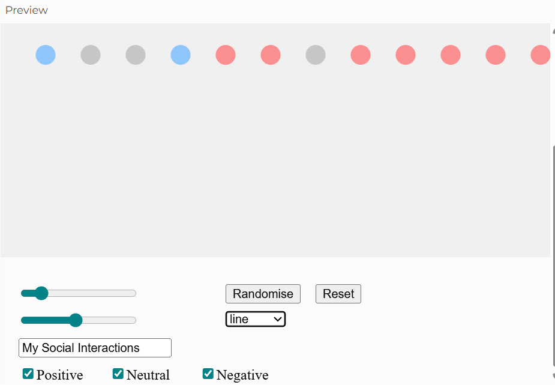
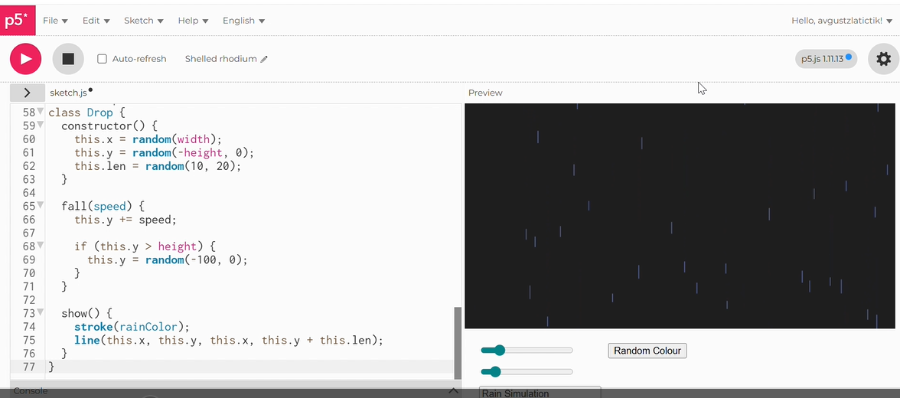
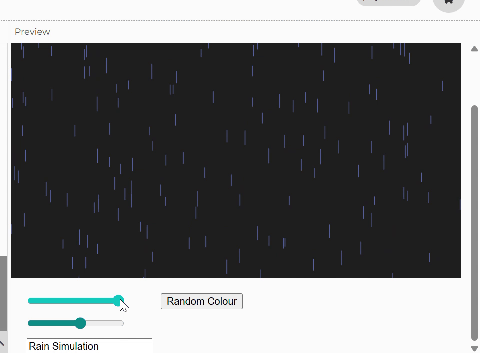

# Week 02

[← Back to Home](../index.md)

## Documentation 

* # Week 02 – Interactivity

## Introduction
This week focused on introducing interactivity using p5.js. The goal was to move from static data drawings (Week 1) into digital sketches that respond to user input. I explored basic coding, then added interactive controls, and finally developed a more complex interactive data visualisation based on my previous experiment.

---

## Activity 1 – Drawing with Code

In this activity, I learned how to use p5.js to create simple visual compositions using code. I experimented with different shapes such as rectangles, circles, triangles, and lines.

I explored how changing colour, size, and position affects the composition. I also tested how the order of the code changes layering—for example, shapes drawn later appear on top of earlier ones.

This helped me understand how code translates directly into visual output, and how small changes can significantly affect the design.

*(Insert screenshot of initial shapes)*  
*(Insert screenshot of colour/position experiments)*

---

## Activity 2 – Interactive Sketch (Mood Interaction)

For this task, I created a simple interactive sketch based on emotions.

The sketch used:
- A slider to control the size of a circle (representing emotional intensity)
- A button to randomly change the colour (representing mood)

This allowed the user to interact with the visual and see immediate changes on the canvas.

Through this, I learned how user input can directly influence visual elements, making the experience more engaging compared to static drawings.

*(Insert screenshot of slider working)*  
*(Insert screenshot of button changing colours)*

---

## Iteration – Social Interaction Map

Building on the earlier activities, I developed a more complex interactive sketch based on my Week 1 data. This visualisation represents social interactions and how they made me feel.

Each interaction is shown as a circle:
- Blue = positive interactions  
- Grey = neutral interactions  
- Red = negative interactions  

I added multiple interactive elements:
- A slider to control the size of interactions  
- A slider to control spacing and layout  
- A button to randomise the arrangement  
- A reset button to return to the original state  
- A text input to customise the title  
- A dropdown menu to change layout (random, grid, line)  
- Checkboxes to filter positive, neutral, and negative interactions  

These controls allow the viewer to explore the data in different ways. For example, filtering interactions makes it easier to focus on specific emotional patterns, while changing the layout reveals different structures in the data.

*(Insert screenshot of early version)*  
*(Insert screenshot of controls)*  
*(Insert screenshot of final interactive sketch)*

---

## Reflection

This week helped me understand how interactivity can add another layer to data visualisation. Compared to my hand-drawn work from Week 1, the digital version allows users to explore and manipulate the data themselves.

One of the main challenges was learning how to connect controls (like sliders and buttons) to visual changes. It took some trial and error to understand how variables affect the drawing.

Using interactivity made the data feel more dynamic and engaging. It also made patterns easier to explore, especially when filtering or changing layouts.

If I had more time, I would improve the visual design further and make the interactions smoother and more refined.

---

## What I Learned
- How to use p5.js to create visual outputs  
- How to use DOM elements like sliders, buttons, and inputs  
- How interactivity can change how data is experienced  
- How to translate personal data into an interactive format.

# Week 02 – Interactivity

## Experiment 2: Interactivity

---

## Overview

This week focused on using p5.js to explore interactivity through code. The aim was to move from static, hand-drawn data (Week 1) into dynamic sketches that respond to user input. This involved learning basic coding principles and using DOM elements such as sliders, buttons, and inputs to control visual outputs. 

---

## Activity 1: Drawing with Code

In this activity, I explored the basics of p5.js by creating simple compositions using shapes such as rectangles, ellipses, and lines.

I experimented with:
- Different shapes 
- Colour variations   
- Layering order (which shapes appear on top)  

One key learning was that the order of code directly affects the visual result. Shapes drawn later overlap earlier ones, which helped me understand how composition works in a coded environment.

  
*Figure 1: Initial Shapes*

  
*Figure 2: Exploring colour and positioning*

---

## Activity 2: Make an Interactive Sketch

For this activity, I created an interactive sketch using DOM elements.

The sketch included:
- A slider to control visual properties  
- A button to randomise elements  
- A text input to display a custom label  

These controls allowed the user to directly influence the visual output. Compared to Activity 1, this made the sketch more engaging, as it responded immediately to input.

### Screenshots

  
*Figure 3: Slider controlling visual changes*

  
*Figure 4: Button and text input interacting with the sketch*

  
*Figure 5: Something*

  
*Figure 6: Something*

---

## Activity 3: Vibe Coding an Interactive Sketch

For this activity, I used ChatGPT to help build a more complex interactive sketch.

I started with a simple idea and gradually added features through multiple prompts. Rather than generating a complete solution at once, I built the sketch step by step:
- Creating a basic visual system  
- Adding interaction (sliders and controls)  
- Refining behaviour and visual output  

This process required both experimentation and understanding the generated code.

### Screenshots

  
*Figure 7: Interactive Rain Stimulation*

  
*Figure 8 GIF: Improved interactive version after iteration*

---

## Independent Study: Interactive Data Portrait

### Overview

For the independent study, I translated my Week 1 data into an interactive p5.js sketch. The data focused on phone-checking frequency across different days and times.

---

## Step 1: Translate Data into Code

I identified key elements from my original drawing:
- Time of day → vertical position  
- Days → horizontal columns  
- Phone checks → represented as marks  

Instead of directly replicating the drawing, I simplified the data into an abstract visual system using lines and dots.

---

## Step 2: Design Interactive Visualisation

I designed an abstract diagram where:
- Each column represents a day  
- The vertical axis represents time  
- Lines and dots represent phone-checking activity  

The sketch includes:
- A time slider to filter visible data  
- An intensity slider to control activity levels  
- Mouse interaction to add new data points  

Behaviour-based logic was introduced:
- Higher usage → longer, thicker lines  
- Lower usage → shorter, thinner lines  

Animation was also added:
- Higher intensity → faster movement  
- Lower intensity → slower movement  

---

## Step 3: Iteration

Through testing and refinement, I improved the clarity and interactivity of the sketch.

Key changes included:
- Structuring the layout into clear day columns and time rows  
- Adding labels to improve readability  
- Introducing motion (wiggle effect) to represent activity  
- Adding a trailing effect to visualise repeated behaviour over time  

### Process Screenshots

  
*Figure 7: Early version of data visualisation*

  
*Figure 8: Improved layout with clearer time and day structure*

---

### Final Output

  
*Final interactive data portrait showing phone-checking behaviour*

---

## Reflection

This project demonstrated how interactivity can transform data visualisation. Compared to my Week 1 drawing, the digital version allows real-time exploration, making patterns more visible and engaging.

Interactivity enables users to filter and manipulate the data, revealing patterns that are not immediately obvious in a static format.

Using ChatGPT supported rapid experimentation, but required understanding and adapting the code to suit my idea.

---

## What I Learned

- How to use p5.js for interactive visual design  
- How to connect user input to visual behaviour  
- How to translate real-world data into abstract forms  
- How animation enhances data representation  
- The importance of iteration in refining ideas  

---

## Future Improvements

If I had more time, I would:
- Refine the visual design further  
- Use my exact recorded data instead of generated values  
- Improve interaction with more responsive controls  

---

## Conclusion

This week showed how coding can be used as a creative tool to explore and communicate data. By combining abstraction, interaction, and iteration, I transformed a static drawing into a dynamic and engaging visual system.

## Images & Media

*Use the format below to embed images from your assets folder:*

``
`*Your caption here*`

*The text inside the square brackets is alt text (a description for accessibility), not a visible caption. To add a caption, place a line of italic text below the image.*

## AI Usage Statement

*Document any use of AI tools under an AI Usage Statement heading. Explain which tools you used and describe how you used them. Reference any AI-generated content (see [QuickCite](https://auckland.libguides.com/referencing-generative-ai-tools) for guidance).*
