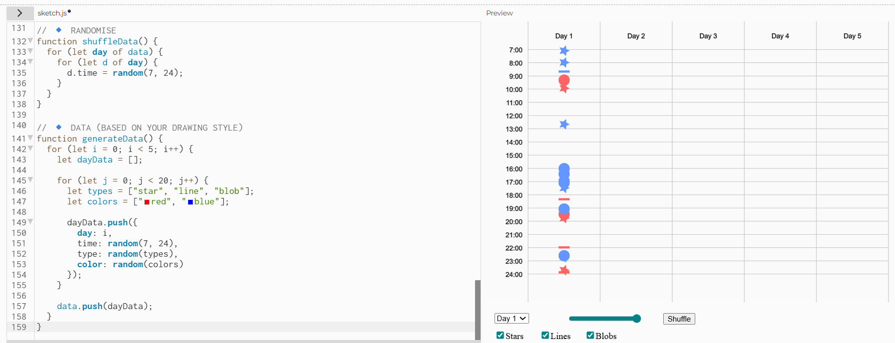
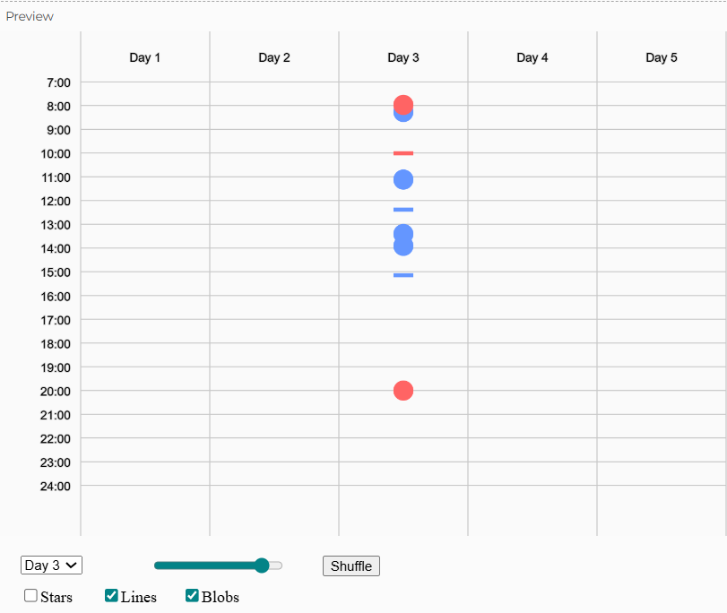
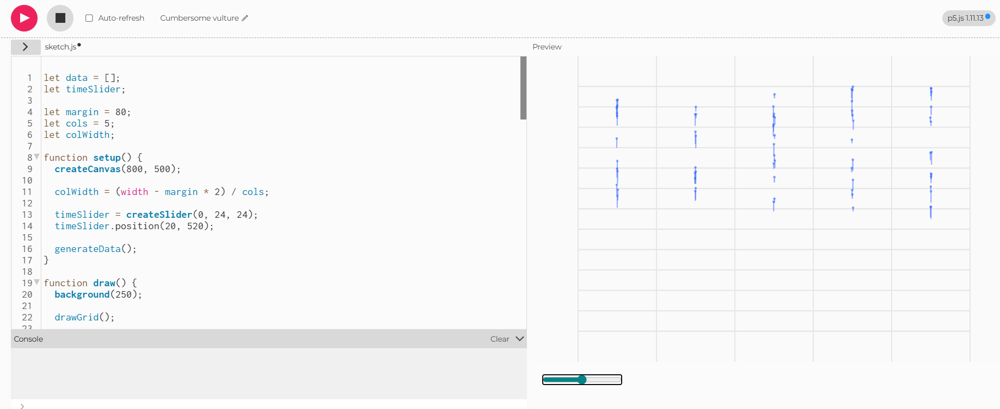
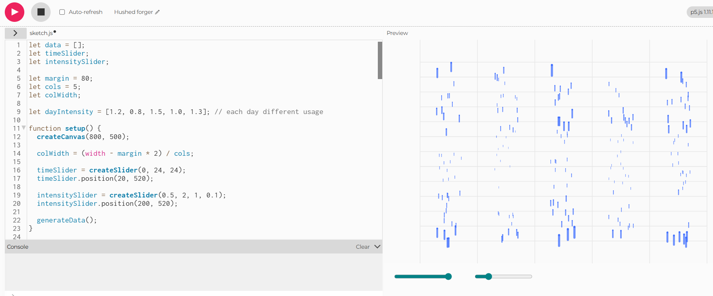
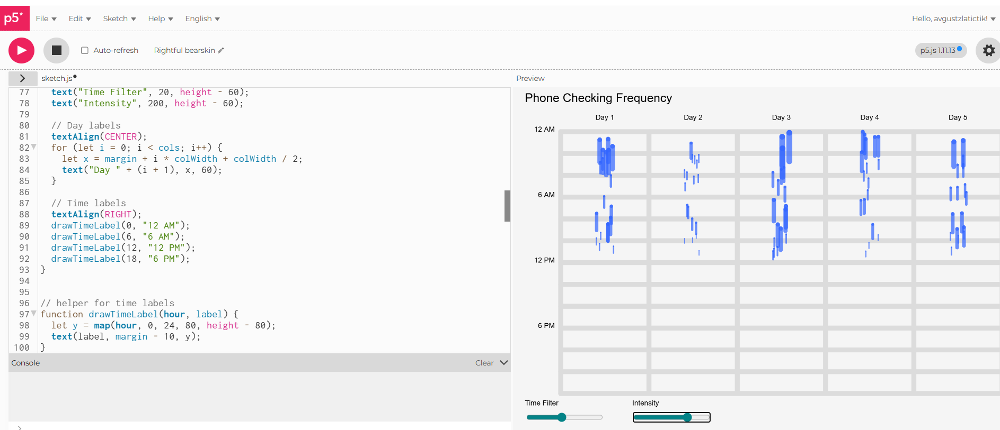

# Week 02

[← Back to Home](../index.md)

## Documentation 

* # Week 02 – Interactivity

## Introduction
This week focused on introducing interactivity using p5.js. The goal was to move from static data drawings (Week 1) into digital sketches that respond to user input. I explored basic coding, then added interactive controls, and finally developed a more complex interactive data visualisation based on my previous experiment.

---

## Activity 1: Drawing with Code

In this activity, I explored the basics of p5.js by creating simple compositions using shapes such as rectangles, ellipses, and lines.

I experimented with:
- Different shapes 
- Colour variations   
- Layering order (which shapes appear on top)  

One key learning was that the order of code directly affects the visual result. Shapes drawn later overlap earlier ones, which helped me understand how composition works in a coded environment.

  
*Figure 1: Initial Shapes*

  
*Figure 2: Exploring colour and positioning*

---

## Activity 2: Make an Interactive Sketch

For this activity, I created an interactive sketch using DOM elements.

The sketch included:
- A slider to control visual properties  
- A button to randomise elements  
- A text input to display a custom label  

These controls allowed the user to directly influence the visual output. Compared to Activity 1, this made the sketch more engaging, as it responded immediately to input.

### Screenshots

  
*Figure 3: Slider controlling visual changes*

  
*Figure 4: Button and text input interacting with the sketch. Random placement. Shows size difference.*

  
*Figure 5: Changed size of impact*

  
*Figure 6: Linear setting. Data shown in order*

---

## Activity 3: Vibe Coding an Interactive Sketch

For this activity, I used ChatGPT to help build a more complex interactive sketch.

I started with a simple idea and gradually added features through multiple prompts. Rather than generating a complete solution at once, I built the sketch step by step:
- Creating a basic visual system  
- Adding interaction (sliders and controls)  
- Refining behaviour and visual output  

This process required both experimentation and understanding the generated code.

### Screenshots

  
*Figure 7: Interactive Rain Stimulation*

  
*Figure 8 GIF: Different Interactive Settings view*

---

## Independent Study: Interactive Data Portrait

### Overview

For the independent study, I translated my Week 1 data into an interactive p5.js sketch. I included all three of my data topics: Screentime, Avoidant desidions  and Social Interactions across different days and times.

---

## Step 1: Translate Data into Code

I identified key elements from my original drawing:
- Time of day = vertical position  
- Days = horizontal columns  
- Phone checks = represented as line marks
- Avoided decidions = stars
- Social interactions = red and blue circles.

I realized that there are too many different data shown in my visual diagram, which makes it confusing to interact with. Therefore, for my first interation, I decided to simplify the data and use only one topic - Phone checks freaquancy and it's length.

  
*All Data Entry*

  
*Day 3 shown*
---

## Step 2: Design Interactive Visualisation

I designed an abstract diagram where:
- Each column represents a day  
- The vertical axis represents time  
- Lines and dots represent phone-checking activity
- One colour is used as there is no colour variables  

The sketch includes:
- A time slider to filter visible data  
- An intensity slider to control activity levels   

  
*Iteration one*
---

## Step 3: Iteration

Through testing and refinement, I improved the clarity and interactivity of the sketch.

Behaviour-based logic was introduced:
- Higher usage = longer, thicker lines  
- Lower usage = shorter, thinner lines 

Animation was also added:
- Higher intensity = faster movement  
- Lower intensity = slower movement

Other key changes included:
- Adding labels to improve readability and understanding  
- Introducing motion (wiggle effect) to represent activity  
- Adding a trailing effect to visualise repeated behaviour over time  

### Process Screenshots

  
*Improved layout. Clearer data length and freakquncy depiction*

  
*Added headings and Interactive features are clear*

---

### Final Output

  
*Final interactive data portrait showing phone-checking behaviour*

---

## Reflection

This project demonstrated how interactivity can transform data visualisation. Compared to my Week 1 drawing, the digital version allows real-time exploration, making patterns more visible and engaging.

Interactivity enables users to filter and manipulate the data, revealing patterns that are not immediately obvious in a static format.

Using ChatGPT supported rapid experimentation. I asked for different prompts and for help in understanding and adapting the code to suit my idea. It was also helpfull asking ChatGPT for ideas to make my sketch more interactive and clear.
---

## What I Learned

- How to use p5.js for interactive visual design  
- How to connect user input to visual behaviour  
- How to translate real-world data into abstract forms  
- How animation enhances data representation  
- The importance of iteration in refining ideas  

---

## Future Improvements

If I had more time, I would:
- Refine the visual design further  
- Improve interaction with more responsive controls
- Experiment with ideas and representation of my data

---

## Conclusion

This week showed how coding can be used as a creative tool to explore and communicate data. By combining abstraction, interaction, and iteration, I transformed a static drawing into a dynamic and engaging visual model.

## AI Usage Statement

*For this week’s journal entry, I used ChatGPT to support the development of my interactive p5.js sketches. I used it to generate code examples, troubleshoot issues, and explore ideas to translate my hand-drawn data into an interactive digital format.

I asked for help with building interactive controls (such as sliders and buttons), refining the visual structure of my sketch, and improving the behaviour of elements (such as adding motion and intensity-based animation).

All generated code was tested and modified to fit my own design intentions and understanding.

### References

OpenAI. (2025). ChatGPT (GPT-5.3) [Large language model]. https://chatgpt.com/*
