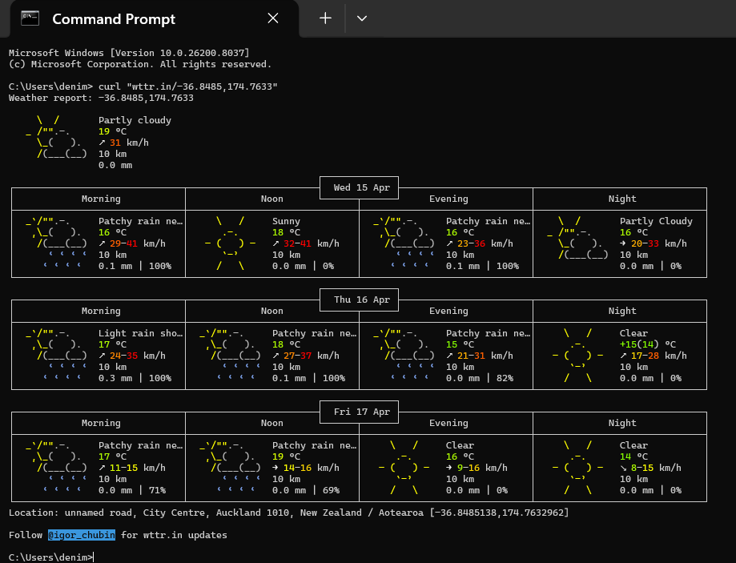
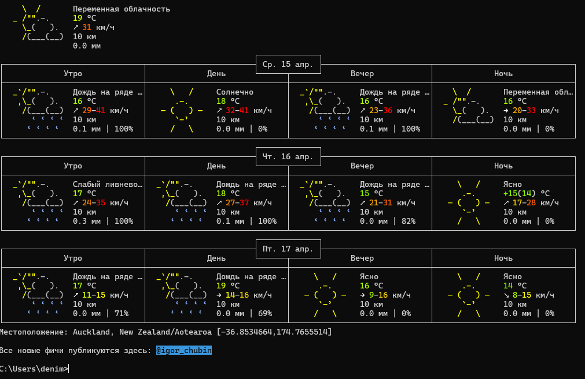
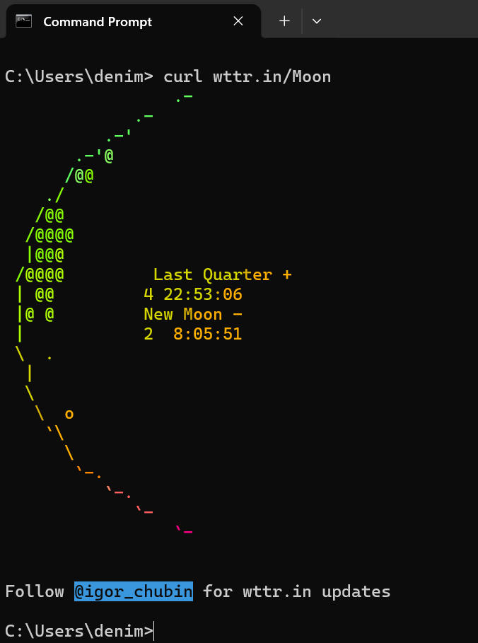
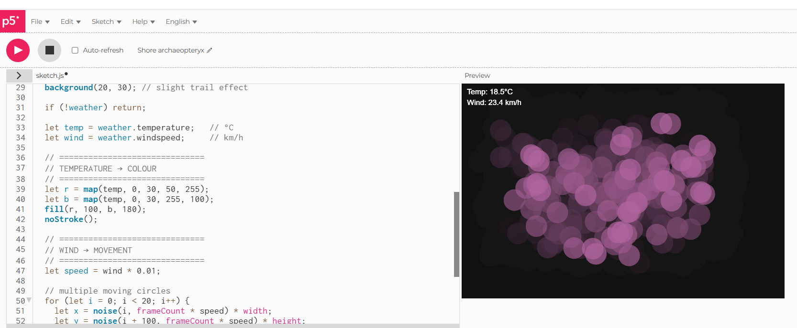
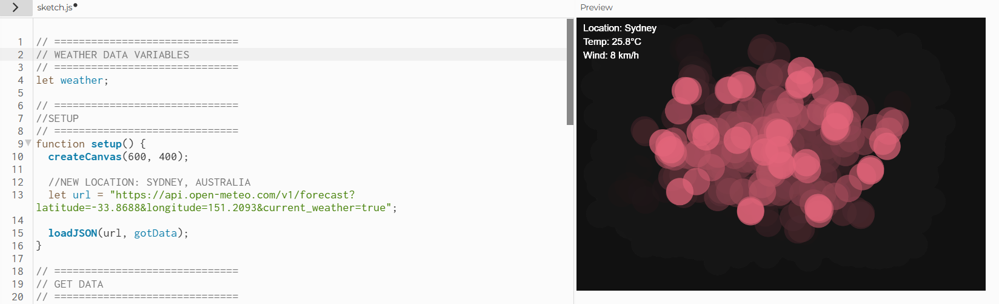
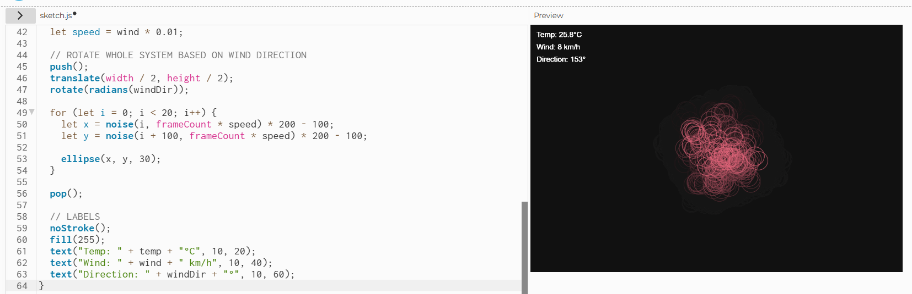
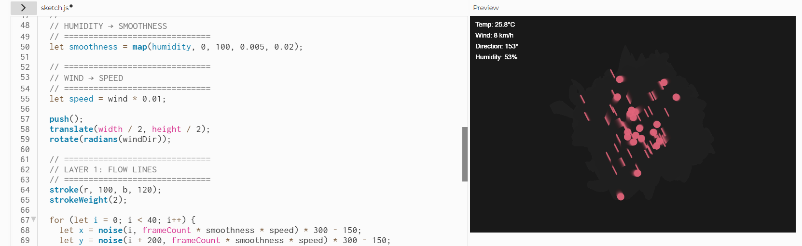
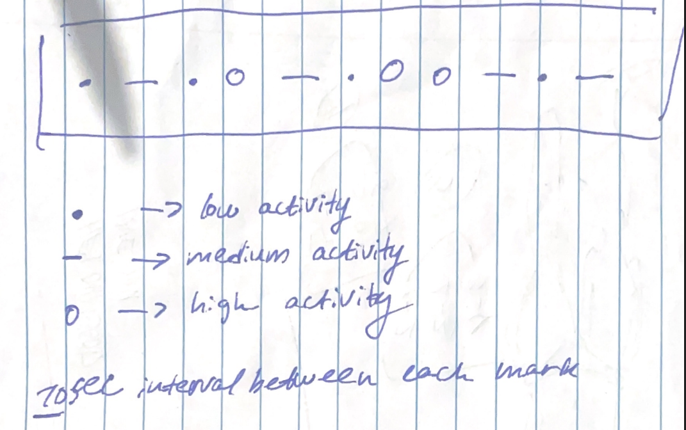

# Week 03

[← Back to Home](../index.md)

## Experiment 3: Live Data

### Overview

This week focused on working with live data using APIs. The aim was to explore how real-time data can be accessed through the terminal and then used as a foundation for creative and interactive visualisations.


## Activity 1: Explore with cURL

Using the terminal, I explored different ways of accessing live data through APIs such as wttr.in.

All data was retrieved using cURL commands and displayed directly in the command prompt.

---

### Weather using GPS coordinates

I used latitude and longitude coordinates to retrieve weather data for Auckland CBD:

```bash
curl "wttr.in/-36.8485,174.7633"
```

This returned a detailed weather report including temperature, wind speed, and precipitation.

  
*Figure 1: Weather data for Auckland retrieved using GPS coordinates*

---

I used the language parameter to display weather data in Russian:

```bash
curl "wttr.in/Auckland?lang=ru"
```

This demonstrated how APIs can localise outputs based on parameters.

  
*Figure 2: Weather output in Russian*

---

### The current moon phase

I retrieved live astronomical data:

```bash
curl wttr.in/Moon
```

This displayed a visual ASCII representation of the moon phase along with timing information.

  
*Figure 3: Moon phase output*

---

### Exploring something new (ASCII output)

I explored an additional feature from the documentation:

```bash
curl ascii.live/nyan
```
This produced an animated ASCII output in the terminal, showing how APIs can also deliver creative or non-traditional data formats.

  
*Figure 4: ASCII animation retrieved*

---

## Activity 2: Weather Visualisation

I used p5.js to visualise live weather data from the Open-Meteo API. I mapped temperature to colour and wind speed to movement, allowing the sketch to respond dynamically to real-world conditions.

In my initial version, the visual consisted of moving shapes whose speed was influenced by wind data, while colour shifted based on temperature. This created a basic but effective connection between data and visual output.

 
*Initial p5.js sketch visualising live weather data*

### Iteration 1 

Experimented with location - changed to Australia/ Sydney to see the difference in motion. 

 *Iteration 1: Location*

### Iteration 2

I improved the sketch by adding wind direction as an additional variable. This allowed the entire visual system to rotate based on real-world wind direction, introducing a stronger sense of spatial behaviour. The movement was no longer random, but instead aligned with environmental conditions, making the output more meaningful.

 *Iteration 2: Wind Direction*

### Iteration 3

I further developed the sketch by combining live data with `noise()` to create smoother and more natural movement. I also introduced humidity as an additional variable, which influenced the density and size of visual elements. Higher humidity resulted in softer, denser visuals, while lower humidity produced lighter and more dispersed forms.

 *Iteration 3: Noise and Humidity*

These iterations made the visualisation more complex and expressive, moving from a simple representation of data to a more dynamic and atmospheric system.

---

## Activity 3: Design and Execute a Data Protocol

### Protocol
**Source**  
Observe activity in the environment (people moving, talking, or using phones).

**Frequency**  
Every 10 seconds for 10 minutes.

**Mapping**
- Low activity - small dot  
- Medium activity - short line  
- High activity - large circle  

This protocol was completed individually rather than in a pair. Instead of comparing results, I focused on how my own interpretation influenced the output. This highlighted how subjective judgement can affect data recording, even within a structured system.

 *Protocol Sketch Activity*

---

## Independent Study: Live Data Visualisation

### Approach

I created an interactive p5.js sketch using live weather data. The goal was to translate real-time environmental data into an abstract visual system.

---

### Mapping

- Wind speed → controls line movement, thickness, and length  
- Temperature → controls colour  
- Slider → adjusts intensity of the visualisation  

Higher wind speeds create more dynamic and energetic visuals, while lower values produce calmer outputs.

---

### Interaction

The sketch includes:
- A slider to control intensity  
- Animated movement using noise()  
- A trailing effect to show motion over time  

---

### Final Output

  
*Figure 5: Final interactive live data visualisation*

---

## Reflection

Working with live data introduced unpredictability into the design process. Unlike static data, the output constantly changes, making the visualisation more dynamic and engaging.

Using APIs allowed me to connect real-world information directly to visual behaviour. This made the project feel more responsive and meaningful.

The use of ChatGPT helped speed up development, but I still needed to understand and refine the code to achieve my intended outcome.

---

## What I Learned

- How to access live data using APIs  
- How to use cURL in the terminal  
- How to map real-world data to visual elements  
- How interaction enhances data visualisation  
- The importance of iteration when working with dynamic systems  

---

## Future Improvements

If I had more time, I would:
- Include additional weather variables (e.g. humidity, rain)  
- Improve the visual design and layout  
- Add more user interaction  

---

## Conclusion

This experiment demonstrated how live data can be used as a creative input. By combining APIs, interaction, and visual systems, I created a dynamic representation of real-world conditions.

---

## AI Usage Statement

I used ChatGPT to assist with coding, debugging, and structuring my ideas. It helped generate p5.js examples and refine my approach to working with live data. All outputs were reviewed and adapted to fit my own design decisions.

### References

OpenAI. (2026). ChatGPT (GPT-5.3) [Large language model]. https://chatgpt.com/


## AI Usage Statement

*Document any use of AI tools under an AI Usage Statement heading. Explain which tools you used and describe how you used them. Reference any AI-generated content (see [QuickCite](https://auckland.libguides.com/referencing-generative-ai-tools) for guidance).*
