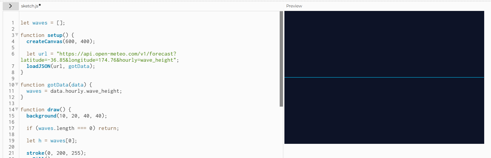
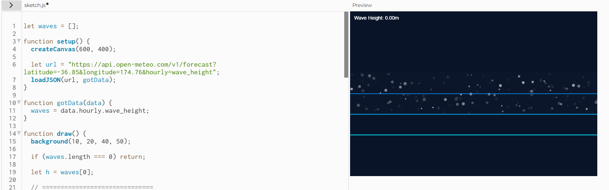
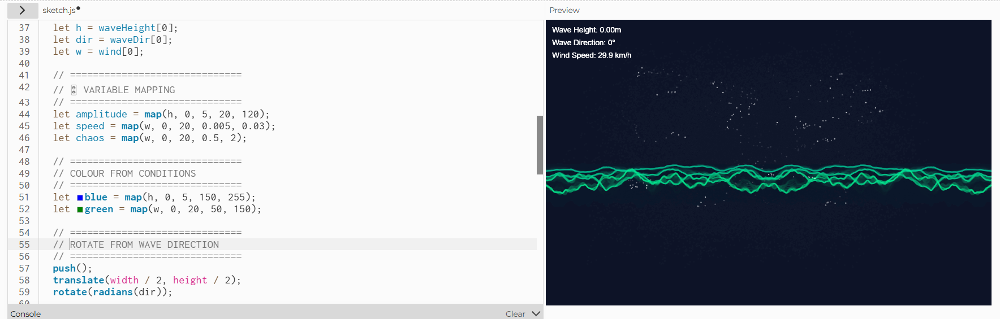
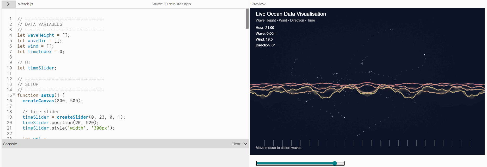

# Week 03

[← Back to Home](../index.md)

## Experiment 3: Live Data

### Overview

This week focused on working with live data using APIs. The aim was to explore how real-time data can be accessed through the terminal and then used as a foundation for creative and interactive visualisations.


## Activity 1: Explore with cURL

Using the terminal, I explored different ways of accessing live data through APIs such as wttr.in.

All data was retrieved using cURL commands and displayed directly in the command prompt.

---

### Weather using GPS coordinates

I used latitude and longitude coordinates to retrieve weather data for Auckland CBD:

```bash
curl "wttr.in/-36.8485,174.7633"
```

This returned a detailed weather report including temperature, wind speed, and precipitation.

  
*Figure 1: Weather data for Auckland retrieved using GPS coordinates*

---

I used the language parameter to display weather data in Russian:

```bash
curl "wttr.in/Auckland?lang=ru"
```

This demonstrated how APIs can localise outputs based on parameters.

  
*Figure 2: Weather output in Russian*

---

### The current moon phase

I retrieved live astronomical data:

```bash
curl wttr.in/Moon
```

This displayed a visual ASCII representation of the moon phase along with timing information.

  
*Figure 3: Moon phase output*

---

### Exploring something new (ASCII output)

I explored an additional feature from the documentation:

```bash
curl ascii.live/nyan
```
This produced an animated ASCII output in the terminal, showing how APIs can also deliver creative or non-traditional data formats.

  
*Figure 4: ASCII animation retrieved*

---

## Activity 2: Weather Visualisation

I used p5.js to visualise live weather data from the Open-Meteo API. I mapped temperature to colour and wind speed to movement, allowing the sketch to respond dynamically to real-world conditions.

In my initial version, the visual consisted of moving shapes whose speed was influenced by wind data, while colour shifted based on temperature. This created a basic but effective connection between data and visual output.

 
*Initial p5.js sketch visualising live weather data*

### Iteration 1 

Experimented with location - changed to Australia/ Sydney to see the difference in motion. 

 *Iteration 1: Location*

### Iteration 2

I improved the sketch by adding wind direction as an additional variable. This allowed the entire visual system to rotate based on real-world wind direction, introducing a stronger sense of spatial behaviour. The movement was no longer random, but instead aligned with environmental conditions, making the output more meaningful.

 *Iteration 2: Wind Direction*

### Iteration 3

I further developed the sketch by combining live data with `noise()` to create smoother and more natural movement. I also introduced humidity as an additional variable, which influenced the density and size of visual elements. Higher humidity resulted in softer, denser visuals, while lower humidity produced lighter and more dispersed forms.

 *Iteration 3: Noise and Humidity*

These iterations made the visualisation more complex and expressive, moving from a simple representation of data to a more dynamic and atmospheric system.

---

## Activity 3: Design and Execute a Data Protocol

### Protocol
**Source**  
Observe activity in the environment (people moving, talking, or using phones).

**Frequency**  
Every 10 seconds for 10 minutes.

**Mapping**
- Low activity - small dot  
- Medium activity - short line  
- High activity - large circle  

This protocol was completed individually rather than in a pair. Instead of comparing results, I focused on how my own interpretation influenced the output. This highlighted how subjective judgement can affect data recording, even within a structured system.

 *Protocol Sketch Activity 2 min long*

---

## Independent Study: Live Data Visualisation

For this activity, I created a p5.js sketch that visualises live ocean data using an external API. The data includes wave height, wind speed, and wave direction, which are translated into an interactive visual system.

### Iteration 1: Basic Mapping

In the first version, I mapped wave height to the size of a single shape. This created a simple visual representation of ocean conditions, where larger waves produced bigger shapes.

This version helped me understand how live data can be directly translated into visual form.

 *Basic Mapping of Waves*

### Iteration 2: Adding Movement

I improved the sketch by introducing `noise()` to create smooth and continuous wave motion. Instead of static shapes, the visual began to behave more like real water.

Wave height now influenced the amplitude of the waves, making the movement feel more natural and dynamic.

 *Iteration 2: Noise*

### Iteration 3: Multiple Variables

I expanded the system by adding more data variables:

- Wave direction - rotation of the visual  
- Wind speed - movement speed and intensity  

This made the sketch more complex, as multiple aspects of the ocean were now influencing the visual output at the same time.

 *Iteration 3: Direction and Wind speed*

### Final Version: Interactive System

In the final version, I introduced interactivity and time-based control.

The sketch includes:
- A slider to move through different hours of the day  
- A visual timeline showing time progression  
- Mouse interaction to distort the waves  

The visual now responds to:
- Wave height (size and amplitude)  
- Wind speed (speed and chaos)  
- Wave direction (rotation)  
- Time (changing data over 24 hours)  

This transformed the sketch into an interactive system where users can explore how ocean conditions change over time.

 *Iteration 4: Visual Timeline and Interactivity*

### Final Output

[View Interactive Sketch](https://editor.p5js.org/avgustzlatictik/full/fUMWDK_xY) (Final interactive ocean data visualisation)

### Reflection

This project showed how live data can be turned into an interactive and expressive visual system. Instead of reading numbers, the viewer can explore patterns through movement, colour, and interaction.

By combining multiple variables with time and user input, the sketch became more dynamic and engaging. The use of noise helped create smoother motion, making the visual feel more natural and less mechanical.

Overall, the final result demonstrates how data can be experienced visually rather than just observed.

## AI Usage Statement

I used ChatGPT to assist with coding, debugging, and structuring my ideas. It helped generate p5.js examples and refine my approach to working with live data. All outputs were reviewed and adapted to fit my own design decisions.

### References

OpenAI. (2025). ChatGPT (GPT-5.3) [Large language model]. https://chatgpt.com/.*