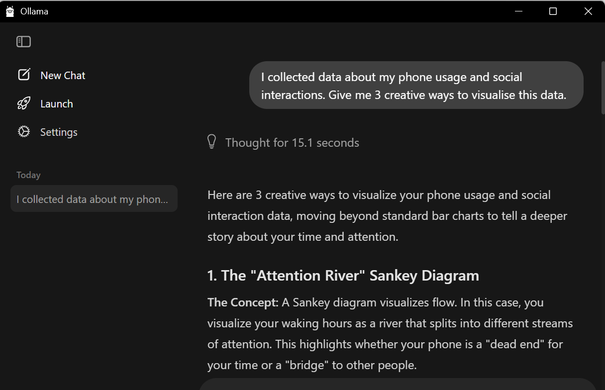
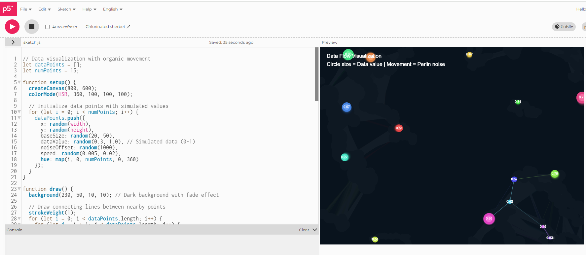
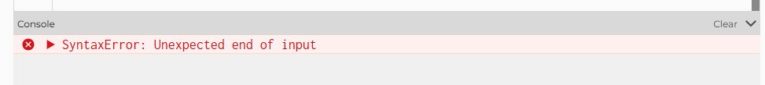
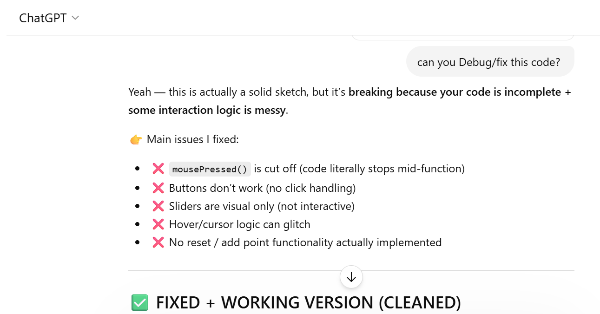

# Week 04

[← Back to Home](../index.md)

## Documentation 

# Week 04 – Artificial Intelligence

My independent study for this week focused on exploring how artificial intelligence can support design and data visualisation through both local and cloud-based workflows. Building on my previous experiments, I was interested in how AI could help generate ideas, write code, and assist with debugging, while also understanding its limitations. This week shifted my thinking from using AI for quick answers to treating it as a tool that needs to be tested, compared, and critically evaluated.

I started by using Ollama as a local AI model. I asked it to give me three creative ways to visualise my data from Experiment 1. I was surprised by the creativity of the responses, as it suggested a range of abstract and expressive ideas. However, the answers felt quite random and not always aligned with what I actually needed for my project.

 *Ollama initial exploration*

I then asked the model to write a general p5.js sketch. This worked more effectively, as it provided a clear step-by-step explanation along with code that was relatively easy to understand and follow. This showed that the model performs better when given more general tasks rather than highly specific or personalised prompts.

 *Ollama initial p5.js code*

However, when I asked it to generate a p5.js sketch using my own dataset from Experiment 1 and include interactive variables, it struggled. The output contained errors that prevented the code from running correctly, and the structure of the sketch was less reliable.

 *Ollama code bug*

To resolve this, I used ChatGPT (a cloud-based AI tool) to debug the code and make it functional. The cloud-based AI was significantly faster and more accurate in identifying issues and improving the structure of the sketch.

 *ChatGPT a cloud-based Ai use*

 *ChatGPT a cloud-based Ai use*

This comparison made the differences between local and cloud-based AI very clear. While Ollama was useful for experimentation and idea generation, it struggled with more complex tasks such as integrating specific data and producing reliable interactive code. In contrast, cloud-based AI was more effective for refining and debugging, making it more practical for my workflow.

## AI Usage Statement

*Document any use of AI tools under an AI Usage Statement heading. Explain which tools you used and describe how you used them. Reference any AI-generated content (see [QuickCite](https://auckland.libguides.com/referencing-generative-ai-tools) for guidance).*
