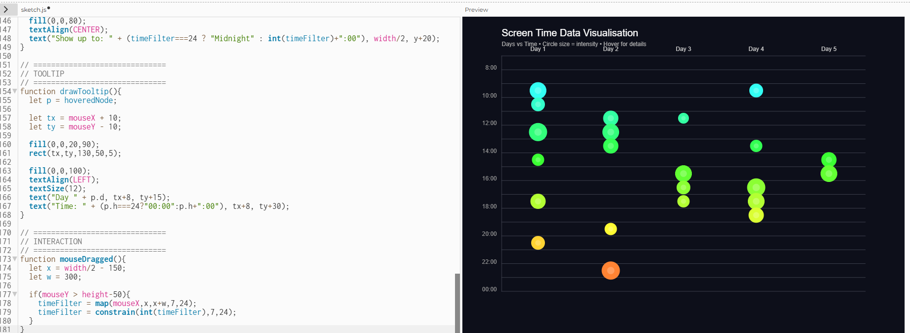
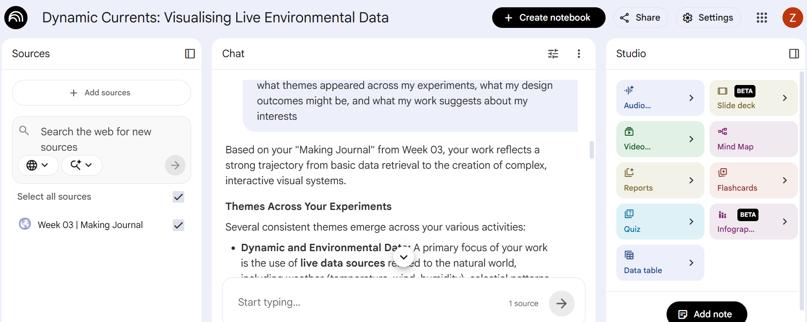

# Week 04

[← Back to Home](../index.md)

## Documentation 

# Week 04 – Artificial Intelligence

My independent study for this week focused on exploring how artificial intelligence can support design and data visualisation through both local and cloud-based workflows. Building on my previous experiments, I was interested in how AI could help generate ideas, write code, and assist with debugging, while also understanding its limitations. This week shifted my thinking from using AI for quick answers to treating it as a tool that needs to be tested, compared, and critically evaluated.

I started by using Ollama as a local AI model. I asked it to give me three creative ways to visualise my data from Experiment 1. I was surprised by the creativity of the responses, as it suggested a range of abstract and expressive ideas. However, the answers felt quite random and not always aligned with what I actually needed for my project.

 *Ollama initial exploration*

I then asked the model to write a general p5.js sketch. This worked more effectively, as it provided a clear step-by-step explanation along with code that was relatively easy to understand and follow. This showed that the model performs better when given more general tasks rather than highly specific or personalised prompts.

 *Ollama initial p5.js code*

However, when I asked it to generate a p5.js sketch using my own dataset from Experiment 1 and include interactive variables, it struggled. The output contained errors that prevented the code from running correctly, and the structure of the sketch was less reliable.

 *Ollama code bug*

To resolve this, I used ChatGPT (a cloud-based AI tool) to debug the code and make it functional. The cloud-based AI was significantly faster and more accurate in identifying issues and improving the structure of the sketch.

 *ChatGPT a cloud-based Ai use*

 *Fixed p5js code using Cloud Ai ChatGPT*

This comparison made the differences between local and cloud-based AI very clear. While Ollama was useful for experimentation and idea generation, it struggled with more complex tasks such as integrating specific data and producing reliable interactive code. In contrast, cloud-based AI was more effective for refining and debugging, making it more practical for my workflow.

## Activity 2: Cloud AI with NotebookLM

In this activity, I used NotebookLM to analyse my own sources, including my Making Journal, my p5.js sketches, and references that influenced my work throughout the course. I also added a short context document to guide the AI, where I described my most interesting experiment, recurring themes, and areas I wanted to explore further.

I asked the AI questions about what themes appeared across my experiments, what my design outcomes might be, and what my work suggests about my interests. The responses were presented as structured summaries, which made it easier to identify patterns that I had not clearly noticed before.

 *Cloud Ai Notebooklm Exploration*

One of the most interesting insights was that the AI identified a consistent focus on interaction and movement across my projects. It suggested that my work often translates data into dynamic visual systems rather than static representations. For example, it connected my interactive p5.js sketches, data drawings, and live data visualisations as part of a broader interest in making data more experiential and engaging.

I found it interesting that the AI was able to create a clear narrative across my work, even though I approached each experiment separately. This gave me a better understanding of my own design direction. However, some of the responses felt slightly simplified and did not fully reflect the complexity of my ideas or intentions.

I also generated the Audio Overview, which presented my work in a conversational format. Listening to this felt different from reading the responses, as it highlighted connections and themes in a more continuous and narrative way. At the same time, it sometimes made assumptions or generalisations that were not entirely accurate.

Overall, this activity showed that cloud-based AI is particularly useful for interpreting and synthesising ideas across multiple sources. Compared to local AI, it felt more effective for higher-level reflection and identifying patterns, rather than generating detailed or precise outputs.

## Independent Study: AI-Assisted Data Exploration

### Overview

For this task, I explored how cloud-based AI tools can be used to interpret and represent real-world data in Aotearoa New Zealand. Rather than relying on a single prompt, I worked through multiple iterations, directing the AI and critically evaluating its outputs.

## Independent Study: AI-Assisted Data Exploration

### Overview

For this task, I explored how cloud-based AI tools can be used to interpret and represent real-world data in Aotearoa New Zealand. I worked through multiple iterations, using AI not just to generate outputs, but to refine and direct the design process.

### Step 1: Dataset Selection

I chose a dataset related to native bird species in Aotearoa New Zealand. I was interested in how environmental data could reveal patterns about biodiversity, distribution, and conservation.

This dataset includes information about different bird species and their presence across regions. It relates to a real aspect of life in Aotearoa, particularly environmental awareness and conservation efforts.
 
*Dataset showing native bird species and distribution*

### Step 2: Understanding the Data

I uploaded the dataset into ChatGPT and asked it to explain the structure and meaning of the data.

The AI explained that the dataset contains information about bird species, their locations, and possibly counts or observations. It highlighted that the data could reveal patterns about where certain species are more common and how biodiversity varies across regions.

However, the dataset does not fully represent ecological complexity. It may not include seasonal variation, environmental conditions, or the causes behind population changes. This means the data provides only a partial view of the ecosystem.
 
*AI explaining dataset structure and patterns*

### Step 3: Multiple Representations

I used AI to generate several different visualisations, refining each version to explore different ways of representing the data.

#### Initial Output

The first output was a basic chart showing the number of bird observations per region. While it was clear and readable, it felt generic and similar to standard data visualisations.

*Basic chart generated by AI*

#### Iteration 1 – Species Distribution Bars

In the first iteration, I focused on comparing species distribution across regions. The data was represented using grouped bars, where each species was shown across different locations.

This made it easier to compare biodiversity, but still relied on conventional chart formats.

*Bar chart showing species distribution*

#### Iteration 2 – Abstract Flock System

In the second iteration, I asked the AI to move away from traditional charts and create a more expressive visualisation. Each bird species was represented as a group of moving particles, forming abstract “flocks”.

The density of the flock represented the number of observations, while movement created a more organic and natural feeling. This made the data feel more alive, rather than static.
 
*Abstract flock-based visualisation*

#### Iteration 3 – Map-Based Ecosystem

In the third iteration, I shifted to a spatial representation using a map of New Zealand. Bird species were represented across regions using colour and small visual markers.

This made the data more intuitive, as it showed how species are distributed geographically rather than numerically.
  
*Map-based bird distribution visualisation*

#### Iteration 4 – Atmospheric Ecology System

In the final iteration, I combined these ideas into a more immersive system. The visualisation used soft movement, layered particles, and subtle animation to represent bird activity across regions.

- Particle density represents species presence  
- Movement reflects activity and distribution  
- Colour variations suggest different species  

This approach focuses less on exact numbers and more on creating an atmospheric understanding of biodiversity.

### Step 4: Critical Evaluation

Working with AI tools made it easy to quickly understand the dataset and generate initial visualisations. However, the AI consistently defaulted to simple charts, standard layouts, and predictable colour schemes.

To create more interesting outcomes, I had to actively direct the AI by changing prompts and pushing it toward more experimental approaches. This showed that AI does not design independently, but reflects patterns from its training data.

Comparing different representations highlighted how interpretation changes depending on the format. Charts emphasise clarity and comparison, while more abstract visuals communicate atmosphere and experience.

### Reflection

The reading on *Data Feminism* (D’Ignazio & Klein, 2020) made me more aware that data is not neutral. Even environmental data reflects decisions about what is recorded and what is left out. This raised questions about which species are prioritised and how biodiversity is represented.

Mikaere’s discussion of Māori data sovereignty also influenced my thinking. It frames data as a cultural and strategic resource, which is especially relevant when working with environmental data in Aotearoa. It suggests that data about land, species, and ecosystems should be considered in relation to indigenous knowledge and values.

Working with AI as a design tool was useful for generating ideas and exploring different visual approaches. However, it required constant direction and critical thinking. The most meaningful outcomes came from combining AI-generated outputs with my own design decisions.

If I had more time, I would further develop a more culturally grounded and context-aware visualisation, potentially incorporating indigenous perspectives and ecological knowledge.

---

### References

D’Ignazio, C., & Klein, L. F. (2020). *Data feminism*. MIT Press.  

OpenAI. (2025). ChatGPT (GPT-5.3) [Large language model]. https://chat.openai.com

Mikaere, K. (2018). *Māori data sovereignty for whānau transformation* [Video]. YouTube.

## AI Usage Statement

I used AI tools (ChatGPT) to support my coding and writing process, including understanding APIs, debugging, and refining ideas. The AI provided guidance and suggestions, but all final design decisions, mappings, and interpretations were developed and evaluated by myself. AI was used as a support and learning tool rather than generating the final work.